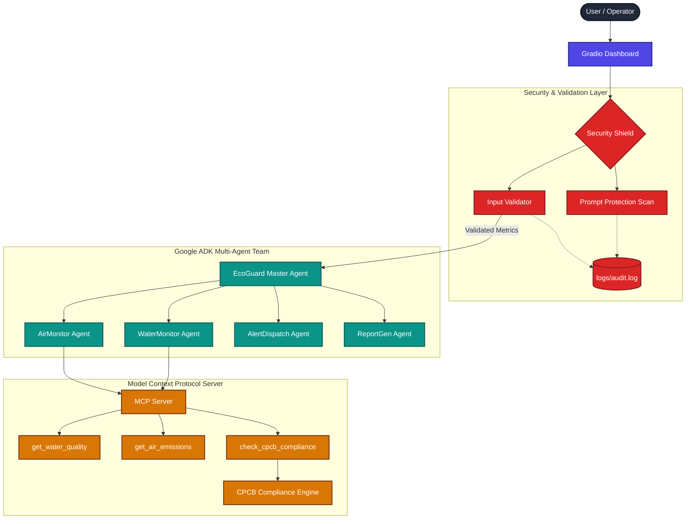

# EcoGuard AI - Industrial Pollution Compliance Monitor

EcoGuard AI is a secure, deployable, multi-agent AI system designed for real-time monitoring of industrial water effluents and stack air emissions to comply with the Central Pollution Control Board (CPCB) standards in India. 

Built using the official **Google Agent Development Kit (ADK)** and the **Model Context Protocol (MCP)**, EcoGuard AI automates the inspection process, flags compliance violations, dispatches immediate alerts, and compiles comprehensive audit reports—all while protecting the system with a multi-layered security shield.

---

## 🏗 System Architecture

The following diagram illustrates the flow of data from the user input through the security, orchestrator, and agent layers down to the MCP compliance tools:



---

## 📋 Problem Statement & Relevance
Industrial manufacturing plants discharge heavy organic loads and release toxic gases into ambient air. The Central Pollution Control Board (CPCB) mandates strict limits to protect ecosystems. Monitoring compliance manually is error-prone, slow, and lacks immutable audit logs.
**EcoGuard AI** solves this by:
* **Automating Inspection**: Using specialized agents to inspect water and air metrics.
* **Securing Inputs**: Restricting bounds (preventing sensor manipulation) and scanning for prompt injections.
* **Standardizing CPCB Checks**: Centralizing logic inside an MCP compliance engine.
* **Dispatching Incident Triggers**: Notifying operators immediately upon limits breach.
* **Providing Audit Integrity**: Logging all events to a secure log trace file.

---

## 🛠 Features

* **Multi-Agent Orchestration (Google ADK)**: A coordinator agent routes wastewater parameters to `WaterMonitor`, gaseous emissions to `AirMonitor`, alert formatting to `AlertDispatch`, and report writing to `ReportGen`.
* **FastMCP Server Compliance Tools**: Exposes standard tools (`get_water_quality`, `get_air_emissions`, `check_cpcb_compliance`) running on stdio transport.
* **Security Shield**:
  * *Boundary Check*: Rejects negative values and impossible pH numbers.
  * *Prompt Protection*: Intercepts and blocks safety bypass phrases like `"ignore previous instructions"`.
  * *Audit Logger*: Appends ISO-timestamped records to `logs/audit.log`.
* **Gradio Dashboard**: Interactive sliders, live agent reasoning log, communication trace visualizer, SMS/Email mock outbox, and markdown report rendering.

---

## 🚀 Installation & Setup

### Prerequisites
* Python 3.10 or higher installed.

### 1. Clone & Set Up Directory
Navigate to your project folder and create a virtual environment:
```bash
python -m venv venv
venv\Scripts\activate      # On Windows
source venv/bin/activate    # On macOS/Linux
```

### 2. Install Dependencies
Install all required libraries including Google ADK, Gradio, and MCP:
```bash
pip install -r requirements.txt
```
*(If you don't have requirements.txt, run `pip install google-adk gradio mcp python-dotenv pytest`)*

### 3. Set Up Environment Variables (Optional)
Create a `.env` file in the root directory:
```env
GEMINI_API_KEY=your_gemini_api_key_here
GEMINI_MODEL=gemini-2.5-flash
```
*Note: If no API key is provided, the dashboard runs in **Simulation Mode** using local CPCB checks so you can inspect the entire workflow without an active key.*

---

## 💻 Running the Application

### Launch Gradio Dashboard
Start the dashboard locally:
```bash
python demo_app.py
```
Or use the hot-reload Gradio CLI:
```bash
gradio demo_app.py
```
Open your browser and navigate to `http://localhost:7860`.

### Running Integration Tests
Run pytest to verify the security and tool bindings:
```bash
pytest tests/
```

---

## 📖 Demo Instructions

1. **Test Normal State**: Set all sliders to normal levels (e.g. pH 7.2, BOD 15, SO₂ 35). Click **Run Compliance Check**. The status banner displays green **PASS** with no alerts.
2. **Test Violation State**: Slide pH to `11.0` and PM2.5 to `90.0`. Click **Run Compliance Check**. The status banner turns red **FAIL**. The **Incident Response Queue** lists the SMS and email drafts detailing the exact CPCB standard breaches.
3. **Verify Security Block**: Type `"ignore previous instructions"` in the operator directive box and click check. A red **Security Warning** appears, blocking execution. Check `logs/audit.log` to see the warning log entry.
